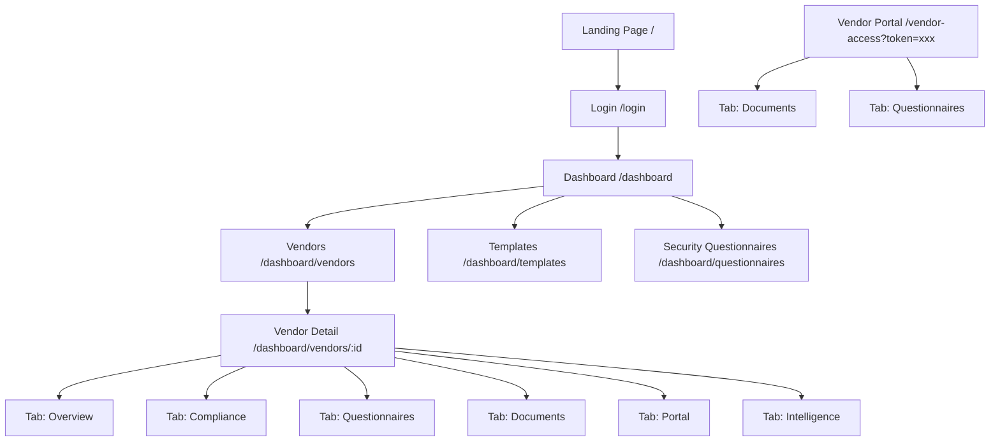
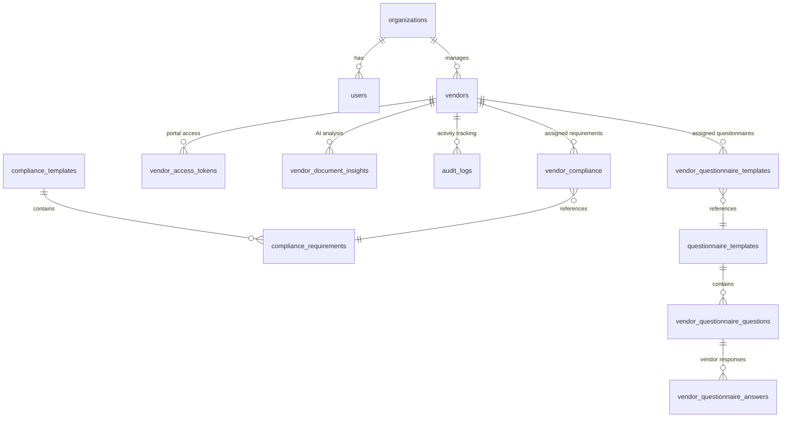

# Sentra — Full Application Workflow

> **AI Vendor Compliance Copilot**
> A platform for managing third-party vendor security, compliance documents, risk assessments, and AI-powered document intelligence.

---

## User Roles

| Role | Access | Authentication |
|------|--------|----------------|
| **Admin** (Internal) | Full dashboard, all vendor management | Email + password via Supabase Auth |
| **External Vendor** | Vendor Portal only (documents + questionnaires) | Token-based access link (48h expiry) |

---

## Sitemap



---

## Flow 1: Authentication

```
Landing Page → [Log In to Dashboard] → Login Page
                                         ├─ Email + Password
                                         ├─ [Log in] → Dashboard
                                         └─ [Sign up] → Create account → Dashboard
```

### Login Page
- **Fields**: Email, Password
- **Actions**: Log In, Sign Up
- **States**: Error banner (red), Success banner (green)
- **Redirect**: → `/dashboard` on success

---

## Flow 2: Risk Executive Dashboard

**Route**: `/dashboard`

### Components
| Component | Description |
|-----------|-------------|
| **High Risk Vendors** | Count card (red) |
| **Medium Risk Vendors** | Count card (yellow) |
| **Low Risk Vendors** | Count card (green) |
| **Average Risk Score** | Numeric card |
| **AI Insight Engine** | Placeholder card ("Coming Soon") |
| **Compliance Alerts** | List of expiring documents with vendor name, doc type, and expiry date |

### Sidebar Navigation
- Dashboard
- Vendors
- Templates
- Security Questionnaires
- [Logout]

---

## Flow 3: Vendor List

**Route**: `/dashboard/vendors`

### Components
| Component | Description |
|-----------|-------------|
| **Add New Vendor Form** | Name (required), Compliance Template dropdown, [Create Vendor] button |
| **Vendor Table** | Columns: Vendor Name (clickable link), Compliance Status (risk badge + progress bar) |

### Interactions
- Click vendor name → Navigate to Vendor Detail page
- Risk badges: `HIGH` (red), `MEDIUM` (yellow), `LOW` (green) + numeric score
- Progress bar: color-coded (red < 50%, yellow 50-99%, green 100%)

---

## Flow 4: Vendor Detail Page (6 Tabs)

**Route**: `/dashboard/vendors/:id`

### Header (always visible)
```
← Back    VendorName    [RISK BADGE • Score: XX]              [Delete Vendor]
```

### Tab 4.1: Overview

```
┌─────────────────────────────────────────────────┐
│  Risk Breakdown                                 │
│  Inherent Risk: XX   Residual Risk: XX   Overall Risk: XX  │
└─────────────────────────────────────────────────┘

┌─────────────────────────────────────────────────┐
│  ▼ Edit Vendor Risk Intake        (collapsible) │
│  ☐ Handles customer or personal data            │
│  ☐ Has production or infrastructure access      │
│  Business Criticality: [Dropdown]               │
│  Data Sensitivity: [Dropdown]                   │
│  [Update Intake]                                │
└─────────────────────────────────────────────────┘

┌─────────────────────────────────────────────────┐
│  Compliance Progress          X of Y Standard Requirements │
│  ▓▓▓▓▓▓▓▓▓▓░░░░░  (progress bar)              │
└─────────────────────────────────────────────────┘

┌─────────────────────────────────────────────────┐
│  Actions                                        │
│  [📄 Generate Compliance Report]                │
└─────────────────────────────────────────────────┘

┌─────────────────────────────────────────────────┐
│  ▼ Vendor Activity               (collapsible)  │
│  ● questionnaire_submitted — by user — date     │
│  ● evidence_uploaded — by user — date           │
└─────────────────────────────────────────────────┘
```

#### Key Interactions
- **Risk Intake Form**: Collapsible card, collapsed by default
- **Generate Compliance Report**: Downloads a PDF; shows "Generating..." loading state
- **Vendor Activity**: Collapsible log of all audit events

---

### Tab 4.2: Compliance

```
Compliance Checklist & Evidence

┌─────────────────────────────────────────────────┐
│  Requirement Name                               │
│  Description text                               │
│  [APPROVED] / [SUBMITTED] / [PENDING]  📎 File │
│                                                 │
│  ┌──────────── Upload Panel ──────────┐         │
│  │ Upload Evidence (PDF, Image)       │         │
│  │ [Choose File]                      │         │
│  │ [Upload Securely] / [Replace File] │         │
│  └────────────────────────────────────┘         │
│                                                 │
│  ┌──────────── Review Panel ──────────┐         │
│  │ (only when status=submitted)       │         │
│  │ [Approve]     [Reject]             │         │
│  └────────────────────────────────────┘         │
└─────────────────────────────────────────────────┘
```

#### States per requirement
| Status | Badge | Actions |
|--------|-------|---------|
| `pending` | Red | Upload evidence |
| `submitted` | Blue | Approve / Reject |
| `approved` | Green | Replace file |
| `rejected` | Red | Re-upload |

---

### Tab 4.3: Questionnaires

```
Security Questionnaires

┌─────────────────────────────────────────────────┐
│ ▶ Template Name (X/Y answered)    [CSV] [PDF]   │
│   ┌─────────────────────────────────────────┐   │
│   │ Q: Do you encrypt data at rest?         │   │
│   │ A: Yes                                  │   │
│   │                                         │   │
│   │ Q: Where is data hosted?                │   │
│   │ A: Supabase                             │   │
│   └─────────────────────────────────────────┘   │
└─────────────────────────────────────────────────┘

┌─────────────────────────────────────────────────┐
│  Assign New Questionnaire                       │
│  Template: [Dropdown]     [Assign]              │
└─────────────────────────────────────────────────┘
```

#### Key Interactions
- **Accordion**: Exclusive expansion (one template open at a time)
- **Export**: CSV and PDF buttons per template
- **Assign**: Dropdown to assign new questionnaire template

---

### Tab 4.4: Documents

```
Documents

┌─────────────────────────────────────────────────┐
│  document_name.pdf          [View] [Download]   │
│  Uploaded: Mar 13, 2026                         │
│  Requirement: ISO27001                          │
└─────────────────────────────────────────────────┘
```

- **View**: Opens modal with iframe (PDF) or img preview
- **Download**: Triggers browser download via secure Blob URL

---

### Tab 4.5: Portal

```
Vendor Portal Access

┌─────────────────────────────────────────────────┐
│  [Generate Access Link]                         │
│                                                 │
│  Link: https://app/vendor-access?token=xxx      │
│  Expires: Mar 15, 2026                          │
│                                                 │
│  [Copy Link] [Send Invite Email] [Revoke Token] │
└─────────────────────────────────────────────────┘
```

#### Key Interactions
- **Generate**: Creates a 48-hour token-based link
- **Send Invite Email**: Sends the link via SMTP
- **Revoke**: Invalidates the current token
- **Re-generate**: Revokes old token + creates new one

---

### Tab 4.6: Intelligence

```
Intelligence

┌─────────────────────────────────────────────────┐
│  Document Type: ISO27001                        │
│  Issuer: Consilium Labs                         │
│  Expiry Date: Jun 6, 2027                       │
│  Confidence: 0.98                               │
│                                                 │
│  [⚠ Expiring Soon] or [❌ Expired]              │
└─────────────────────────────────────────────────┘
```

- Shows AI-extracted metadata from uploaded documents
- Auto-flags documents nearing expiry (≤60 days) or already expired

---

## Flow 5: Compliance Templates

**Route**: `/dashboard/templates`

```
┌─────────────────────────────────────────────────┐
│  Create New Template                            │
│  Template Name: [input]                         │
│  Description: [input]                           │
│                                                 │
│  Included Requirements:                         │
│  ☐ ISO27001  ☐ SOC2  ☐ GDPR  ☐ Insurance      │
│                                                 │
│  [Save Template]                                │
└─────────────────────────────────────────────────┘

┌─────────────────────────────────────────────────┐
│  Template Name    │ Description  │ Created      │
│  Standard SaaS    │ For SaaS...  │ Jan 20, 2026 │
└─────────────────────────────────────────────────┘
```

---

## Flow 6: Security Questionnaire Builder

**Route**: `/dashboard/questionnaires`

```
┌─────────────────────────────────────────────────┐
│  Create New Template                            │
│  Name: [input]   Description: [input]           │
│  [Create Template]                              │
└─────────────────────────────────────────────────┘

┌─────────────────────────────────────────────────┐
│  Template: "Security Assessment v1"             │
│  ┌───────────────────────────────────────────┐  │
│  │ Add Question                              │  │
│  │ Text: [input]   Type: [yes_no / text]     │  │
│  │ [Add Question]                            │  │
│  └───────────────────────────────────────────┘  │
│                                                 │
│  Questions:                                     │
│  1. Do you encrypt data at rest? (yes_no)       │
│  2. Where is data hosted? (text)                │
└─────────────────────────────────────────────────┘
```

---

## Flow 7: External Vendor Portal

**Route**: `/vendor-access?token=xxx`

> No login required. Access via token-based link (48h validity).

### Layout: 2 Tabs

#### Tab 7.1: Documents

```
Vendor Name — Compliance Portal

Progress: X of Y Requirements Submitted
▓▓▓▓▓▓▓▓░░░░

┌─────────────────────────────────────────────────┐
│  Requirement: ISO27001                          │
│  Description: Provide certificate               │
│  Status: [PENDING] / [SUBMITTED] / [APPROVED]  │
│                                                 │
│  [Choose File]  [Submit Evidence]               │
└─────────────────────────────────────────────────┘

✅ Upload successful banner (after submission)
```

#### Tab 7.2: Questionnaires

```
┌─────────────────────────────────────────────────┐
│  ▶ Security Assessment v1   (2/5 answered)      │
│  ┌───────────────────────────────────────────┐  │
│  │ Do you encrypt customer data at rest?     │  │
│  │ ○ Yes  ○ No  [Clear Answer]               │  │
│  │                                           │  │
│  │ Where is customer data hosted?            │  │
│  │ [text input, prefilled if answered]       │  │
│  └───────────────────────────────────────────┘  │
│  [Submit Answers]                               │
└─────────────────────────────────────────────────┘

✅ Questionnaire submitted successfully banner
```

#### Key Interactions
- **Accordion**: Exclusive expansion for multiple questionnaires
- **Partial submission**: Allowed (no validation forcing all answers)
- **Clear Answer**: Available for yes/no questions
- **Prefill**: Previously submitted answers are pre-filled

---

## Flow 8: PDF Compliance Report Generation

**Triggered from**: Vendor Detail → Overview → Actions → [Generate Compliance Report]

### Report Sections
1. **Header**: "Sentra Vendor Security Report", Vendor Name, Generated Date
2. **Risk Overview**: Inherent Risk, Residual Risk, Overall Risk Score
3. **Compliance Documents**: Each doc with status (Approved/Rejected/Pending)
4. **Document Intelligence**: AI-detected docs with issuer, expiry, confidence
5. **Security Questionnaires**: Per template — questions and vendor answers

### UX Flow
```
[Generate Compliance Report] 
   → Button shows "Generating..." (disabled)
   → Server generates PDF via pdf-lib
   → Browser auto-downloads: sentra_vendor_report_vendorname_2026-03-16.pdf
   → Button resets to default state
```

---

## Automated Background Processes

| Process | Trigger | Effect |
|---------|---------|--------|
| **AI Document Analysis** | Evidence upload (dashboard or portal) | Extracts document type, issuer, expiry, confidence → stores in `vendor_document_insights` |
| **Compliance Expiry Monitor** | Supabase Edge Function (scheduled) | Scans for documents expiring within 60 days → creates `compliance_expiry_warning` audit log → appears on Dashboard alerts |
| **Risk Score Recalculation** | After evidence upload in vendor portal | Recalculates inherent, residual, and overall risk scores |

---

## Data Model Overview



---

## Key UI Patterns

| Pattern | Used In |
|---------|---------|
| **Collapsible Cards** | Risk Intake Form, Vendor Activity Log |
| **Tabbed Navigation** | Vendor Detail (6 tabs), Vendor Portal (2 tabs) |
| **Exclusive Accordion** | Questionnaires (admin + vendor portal) |
| **Risk Badges** | Vendor list, vendor header — color-coded pills |
| **Progress Bars** | Compliance progress (vendor list + detail + portal) |
| **Status Badges** | `PENDING` (red), `SUBMITTED` (blue), `APPROVED` (green) |
| **Loading States** | Report generation button ("Generating...") |
| **Modal Previews** | Document viewer (iframe for PDFs, img for images) |
| **Inline Forms** | Evidence upload, questionnaire answers |
| **Action Buttons** | Approve/Reject, Generate Link, Send Email, Revoke |

---

## Color System

| Element | Color |
|---------|-------|
| High Risk | `#dc2626` (red) |
| Medium Risk | `#ca8a04` / `#eab308` (yellow) |
| Low Risk | `#16a34a` (green) |
| Muted Text | `var(--muted)` |
| Card Background | `var(--card-bg)` |
| Borders | `var(--border)` |
| Primary Action | `var(--primary)` |
| Sidebar | `var(--sidebar-bg)` |

---

*Document generated from codebase analysis — March 16, 2026*
